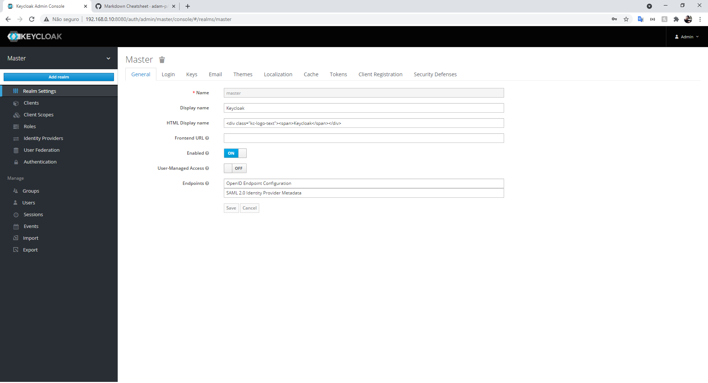
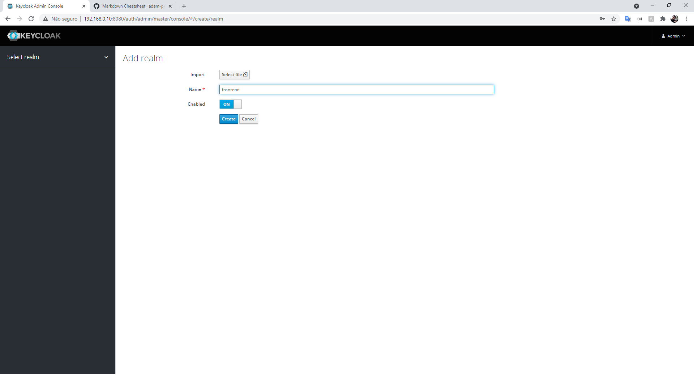
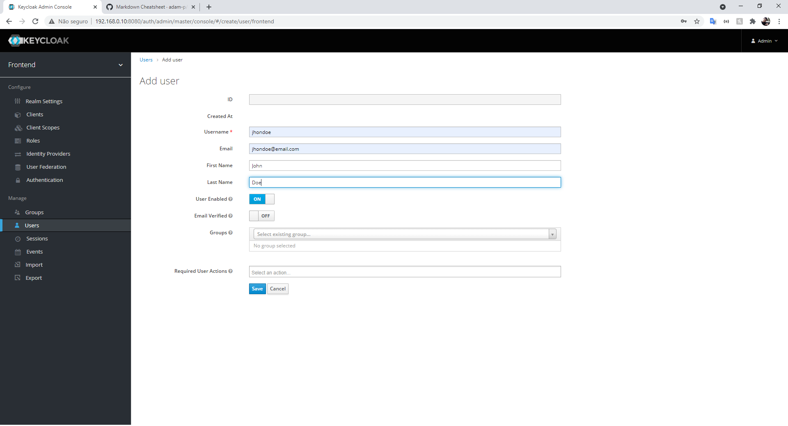
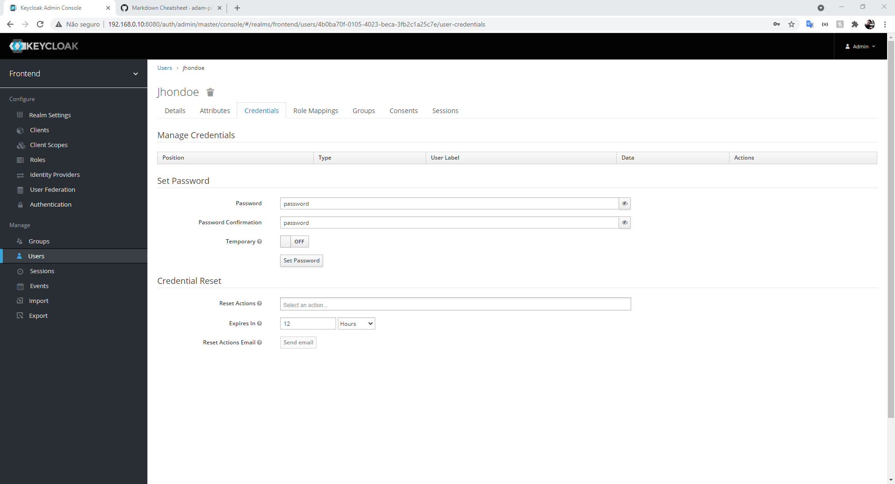
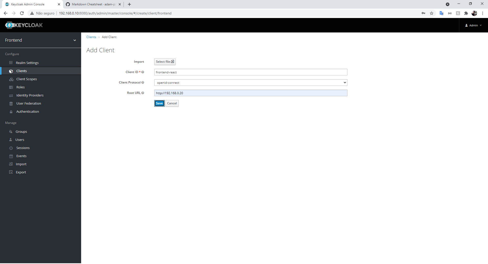
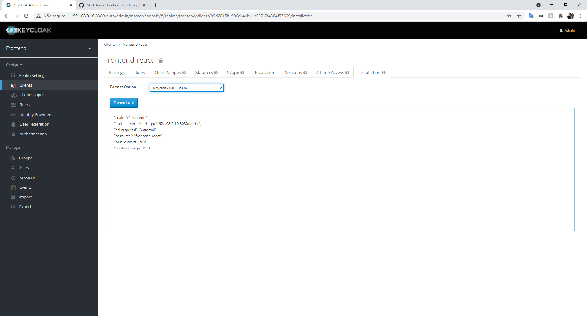

# React e Keycloak - Exemplo

Este projeto foi desenvolvido para servir como uma `demonstração` de [Keycloak](https://www.keycloak.org/) em conjunto com [React](https://reactjs.org/). O projeto usa como base o [Vagrant](https://www.vagrantup.com/) para criar VM's (Máquinas Virtuais) e para gerenciar os ambientes de servidor e cliente de forma separada.

**Observação: A VM de cliente usa [Nginx](https://www.nginx.com/) para servir o HTTP**

**Nota**: Este exemplo não se aprofunda em detalhes sobre o Keycloak, React, Node, Nginx, Vagrant ou Ubuntu. Apenas demonstra como juntar todas essas ferramentas. Não usar este exemplo como um guia definitivo, apenas uma demonstração com algumas explicações.

## Requisitos (Host)

São os programas e pacotes que são necessarios estarem instalados na máquina host, ou seja, aquela que estaram sendo criadas as VM's

- [VirtualBox](https://www.virtualbox.org/)
- [Vagrant](https://www.vagrantup.com)
- [Node](https://nodejs.org/)

## Setup (Host)

Após realizar a instalação dos arquivos necesarios, clone o repositorio para uma pasta na sua máquina host.

## Setup (Backend)

Abra o terminal na na root da sua pasta e execute o comando:

```bash
vagrant up backend
```

Esse comando ira executar o bloco `backend` dentro do Vagranfile.

**Nota:** Durante a primeira execução pode ocorrer uma demora, pois o Vagrantfile precisa baixar a Box, e realizar o update dos pacotes alem de instalar as dependencias (Docker e Docker-Compose).

Quando a execução for finalizada, abra no navegador o link: http://192.168.0.10:8080/auth/admin e logue usando as credenciais de admin configuradas no docker-compose.yml **(usuario: admin | senha: password)**

Após logado voce será redirecionado para o painel de admin, nele, passe o mouse em cima de "Mater" e selecione a opção indicada na imagem abaixo:


Crie um novo realm com um nome qualquer:


Após a criação do relm, iremos criar um usuario:


Agora criaremos a senha deste usuario, para isto clique em 'credentials' no painel de usuario:

**Nota:** A opção 'Temporary' indica que sera uma senha temporaria definida pelo admin, na primeira vez que o usuario logar, sera solicitado uma nova senha a escolha do usuario


Por fim criaremos o cliente:

**Nota:** O Root URL (neste exemplo) é o ip da VM do Frontend, ainda não executamos ela, porem no Vagrantfile o ip configurado é `192.168.0.20`


Com o cliente cadastrado, basta irmos na aba 'installation', selecionar o formato `JSON` e baixa-lo. Este arquivo sera necessario para o setup do frontend:


### Vagrantfile

**Nota:** Não há necessidade de alterar as configurações padrões deste Vagrantfile

Especificações do bloco `backend`:

A Box (Formato do pacote para ambientes Vagrant) usada para a VM do Backend foi a Ubuntu v18.04

```ruby
backend.vm.box = "bento/ubuntu-18.04"
```

A rede é definida como sendo privada e configuramos para a VM rodar no ip: `192.168.0.10`

```ruby
backend.vm.network "private_network", ip: "192.168.0.10"
```

É necesario enviar o arquivo .yml com as configurações do Docker-Compose. Para isso criamos uma provisão que será executada apenas uma vez quando a VM for criada

```ruby
backend.vm.provision "docker-compose file",
  type: "file",
  source: "./backend/docker-compose.yml",
  destination: "docker-compose.yml"
```

As configurações para poder instalar o Docker e o Docker compose tambem são realizadas atraves de uma provisão que será executada apenas uma vez quando a VM for criada

```ruby
backend.vm.provision "setup", type: "shell", inline: <<-SHELL
  # Atualiza  o Sistema
  apt update
  apt upgrade -y

  # Instala as Dependencias
  apt-get install curl apt-transport-https ca-certificates software-properties-common -y

  # Adiciona Chave GPG
  curl -fsSL https://download.docker.com/linux/ubuntu/gpg | sudo apt-key add -

  # Adiciona o Repositorio  Docker
  add-apt-repository "deb [arch=amd64] https://download.docker.com/linux/ubuntu $(lsb_release -cs) stable"

  # Atualiza as Informações do Repositorio
  apt update

  # Instala o Docker Ubuntu 18.04
  apt install docker-ce -y

  # Baixa o Docker Compose
  curl -L "https://github.com/docker/compose/releases/download/1.29.1/docker-compose-$(uname -s)-$(uname -m)" -o /usr/local/bin/docker-compose

  # Aplica Permissões Executaveis no Arquivo Binario
  chmod +x /usr/local/bin/docker-compose

  # Adiciona Usuario no Grupo Docker
  usermod -aG docker $USER
SHELL
```

Por fim é necessario realizar o Docker-Compose sempre que a VM for iniciada. Usamos uma provisão com a propriedade `run` sendo `always`. Dessa forma, diferente das outras provisões, esta sera executada sempre que o comando `vagrant up` for executado.

```ruby
backend.vm.provision "compose", type: "shell", run:"always", inline: <<-SHELL
  docker-compose up -d
SHELL
```

### docker-compose.yml

**Nota:** Não há necessidade de alterar as configurações padrões deste docker-compose.yml.

Dentro deste arquivo estão as configurações dos serviços usados no backend. Para este exemplo apenas dois serviços são necessarios, sendo eles o banco de dados [PostgreSQL](https://www.postgresql.org/) e o Keycloak

As portas configuradas para o Keycloak foram: 8080 e 8443.

## Setup (Frontend)

Abra o terminal na pasta frontend e execute o comando:

```bash
npm install
```

Este comando ira instalar as dependencias do nosso projeto React.

Após a instalação dos pacotes, adicione o arquivo keycloak.json que foi baixado do console admin do Keycloak na pasta public dentro da aplicação React, e execute:

**Nota:** O procedimento para montar do zero a aplicação React e conecta-la ao keycloak pode ser encontrada [aqui](https://scalac.io/blog/user-authentication-keycloak-1/)

```bash
npm run build
```

Este comando ira montar a nossa aplicação pronta para proução

Em seguida, abra o terminal na na root da sua pasta e execute o comando:

```bash
vagrant up frontend
```

Esse comando ira executar o bloco `frontend` dentro do Vagranfile.

**Nota:** Durante a primeira execução pode ocorrer uma demora, pois o Vagrantfile precisa baixar a Box, e realizar o update dos pacotes alem de instalar as dependencias (Nginx).
